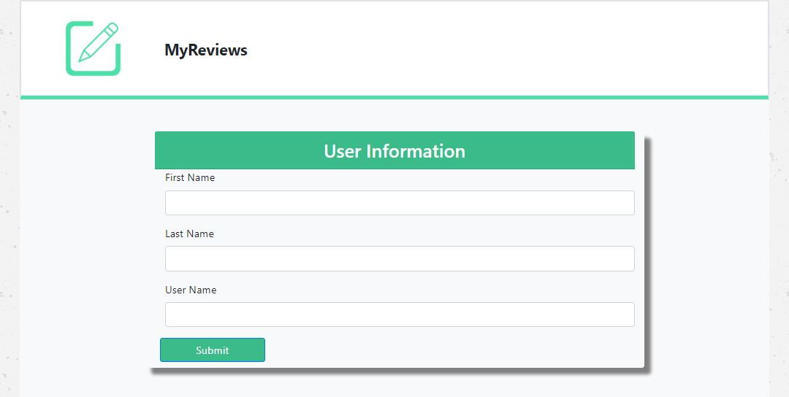
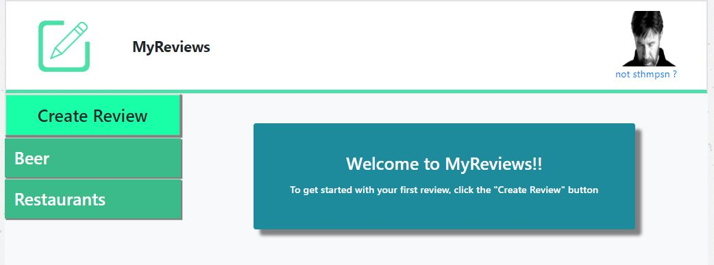
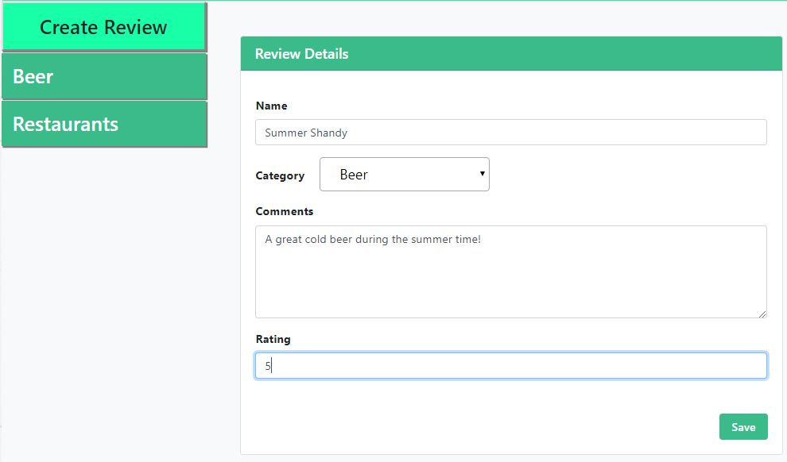
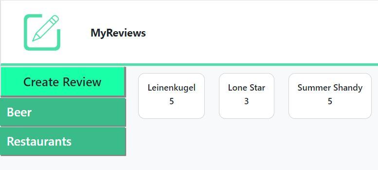
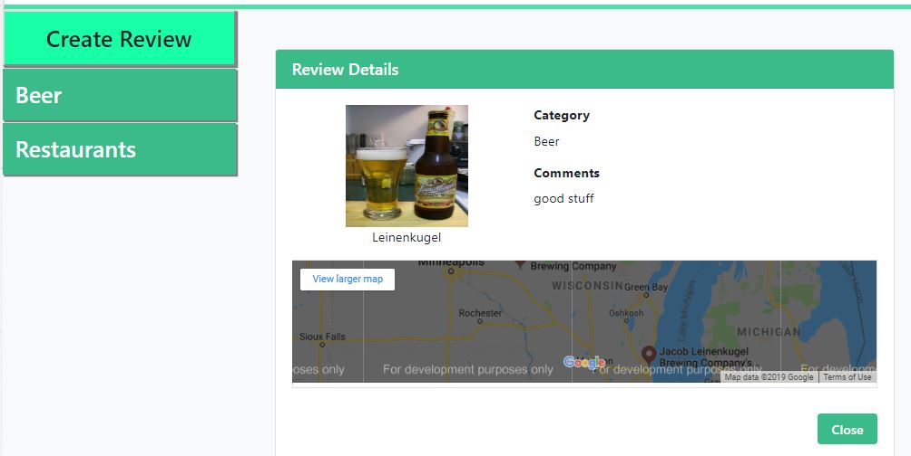

# ReviewMe
A Review site that provide users with the ability to take notes and rate their favorite beers and restaurants.

## Deployed Application
https://sthmpsn.github.io/ReviewMe

## Instructions
* Navigate to the application link below
* Enter your First, Last, and Username then click submit to log in (your username will be created and stored in the database)
* Note your cool random Chuck Norris Avatar in the top right (click the image to get a better view)
* If you have no reviews then you will want to click the "Create Review" button
   * Fill out the Review Form and click "Save"
   * You can then selec the Category that you entered your review for and see the entry
* If you are a returning user and have existing reviews entered then select the category of your choosing
   * Select a review that you'd like to recall your notes and ratings for by clicking the review
   * When in the Review Details you'll see a random flickr image along with your review details and a google maps location which shows the result of if you went to google maps and enter the review name in the search
   * Click "Close" when finished reviewing the details
* If you want to sign in as a different user or logoff then click link in the top right that states "not <username>?" and this will take you back to the login page

## Technologies
* Adobe XD
* HTML
* CSS
* Bootstrap4
* Magnafic
* JavaScript
* Google Fonts
* jQuery animation
* Firebase
   * Real-Time Database
* API calls (Flickr and Google Maps)
   * Google imbedded API for map based on search
   * Flickr Photo Search
* Local Storage

## Screenshots

## Contributors
* John Evans (evanjo03)
* Olivia Yang (lazypanda21)
* Bill Fehlberg
* Steve Thompson (sthmpsn)
